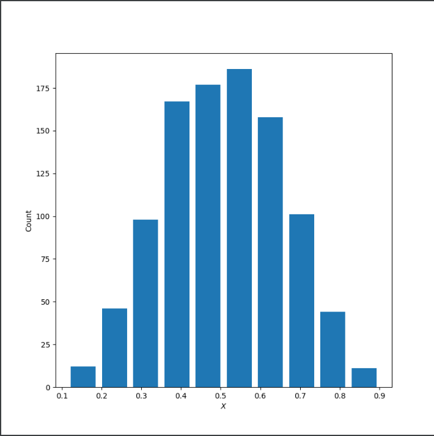
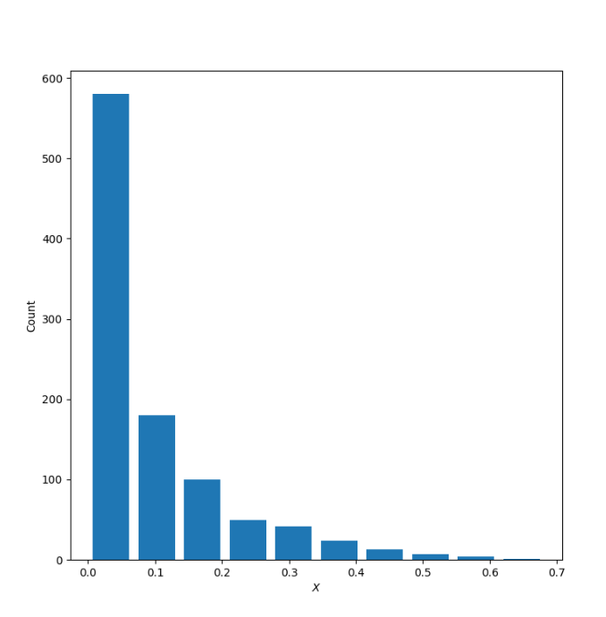
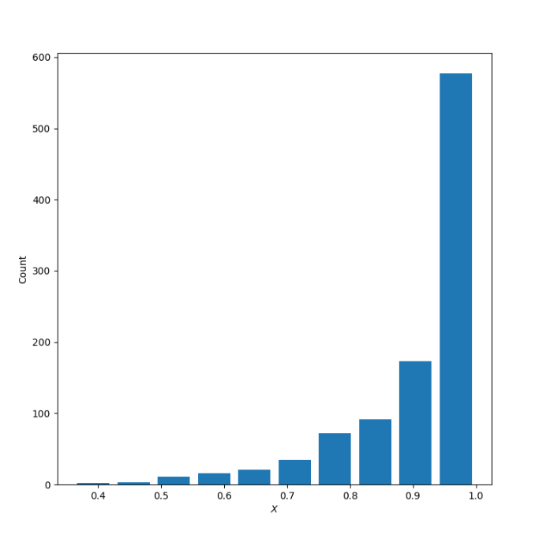
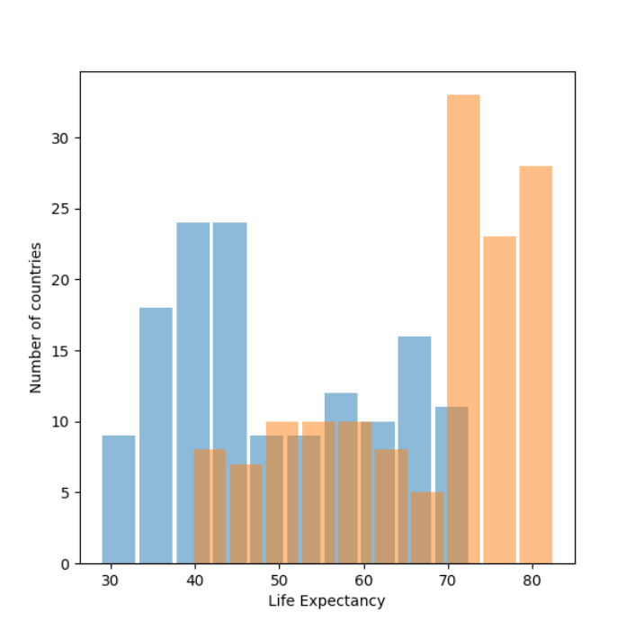
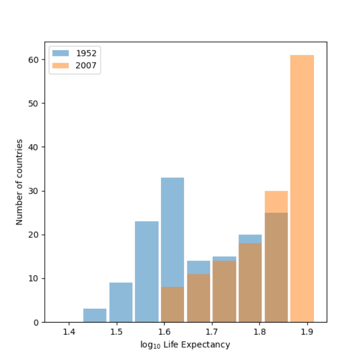
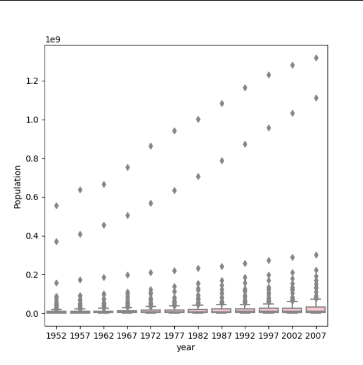
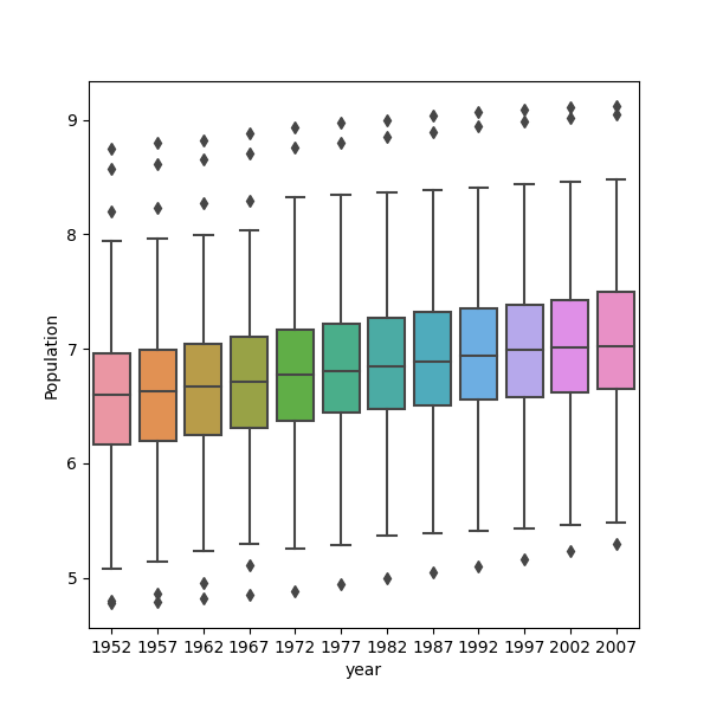

**Describe continuous, ordinal and nominal data. Provide examples of each. Describe a model of your own construction that incorporates variables of each type of data. You are perfectly welcome to describe your model using english rather than mathematical notation if you prefer. Include hypothetical variables that represent your features and target.**

Continuous data is data that takes on a range of values. For example people's height and age are continuous. Ordinal data is numeric but only the order of the values is important. For example, the top 10 students in a grade would be ordinal because it is a ranking of students. Also, eventhough this type of data has numeric values, they are used as categorical. Nominal data is caegorical data that is grouped or labeled without quantitative value. There is not neccessarily logic to the categories. For example, in the gapminder dataset country and continent are two categories that are nominal.

|  Runner Ranking  | Runner        | Race time  | 
| ---------------- |:-------------:| ----------:|
| 1                | Emma          | 15:45      | 
| 2                | Matt          | 16:43      |
| 3                | Jojo          | 16:46      |
| 4                | Cole          | 16:56      | 

In this model the Runner Ranking is ordinal data because it represents each runner's place in the race. The Runner column represents nominal data and the race time represents continuous data. All three columns are features with the correlation between runner ranking and race time being the target. From this table you can predict that someone with the fastest time will be ranked the highest.

**Comment out the seed from your randomly generated data set of 1000 observations and use the beta distribution to produce a plot that has a mean that approximates the 50th percentile. Also produce both a right skewed and left skewed plot by modifying the alpha and beta parameters from the distribution. Be sure to modify the widths of your columns in order to improve legibility of the bins (intervals). Include the mean and median for all three plots.**

X: 50th Percentile

Mean: 0.5025754772439277

Median: 0.5062831511790717

X:Right Skewed

Mean: 0.0915604985073129

Median: 0.04841800001882425

X:Left Skewed

Mean: 0.9097102468340331

Median: 0.9512730487601434

**Using the gapminder data set, produce two overlapping histograms within the same plot describing life expectancy in 1952 and 2007. Plot the overlapping histograms using both the raw data and then after applying a logarithmic transformation (np.log10() is fine). Which of the two resulting plots best communicates the change in life expectancy amongst all of these countries from 1952 to 2007?**

**Using the seaborn library of functions, produce a box and whiskers plot of population for all countries at the given 5-year intervals. Also apply a logarithmic transformation to this data and produce a second plot. Which of the two resulting box and whiskers plots best communicates the change in population amongst all of these countries from 1952 to 2007?**

Box and whisker plot: 

Box and whisker plot with logarithmic transformation:

