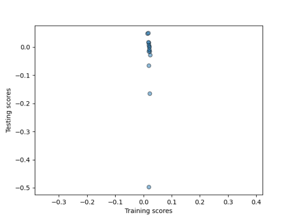
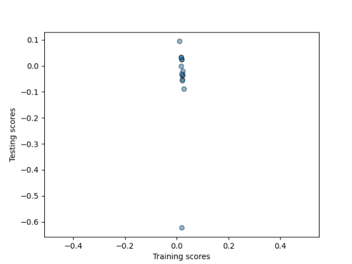
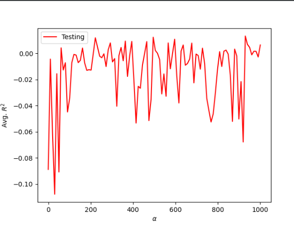
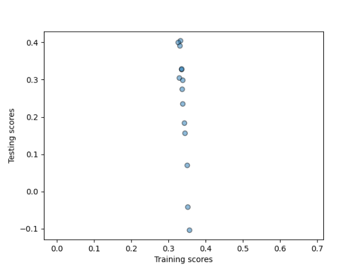
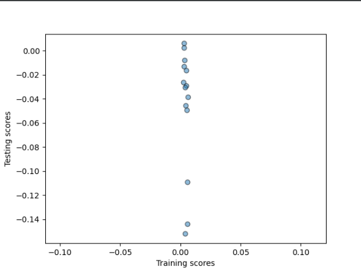
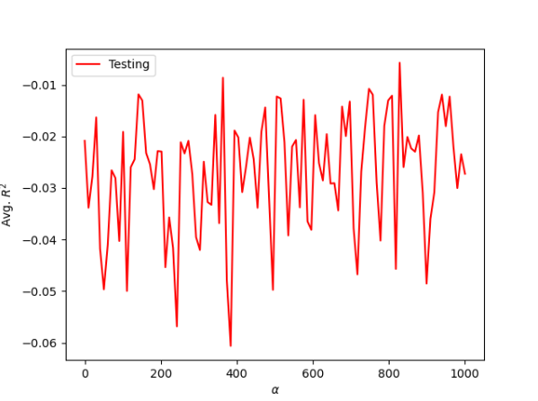
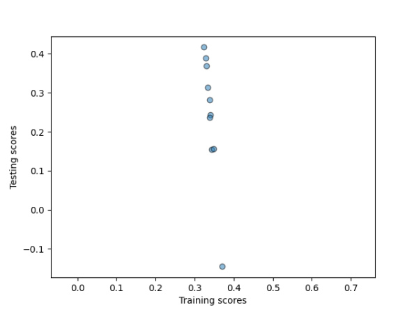
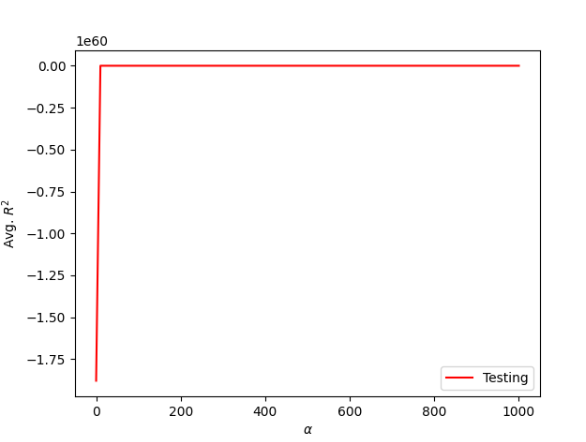

## Download the dataset charleston_ask.csv and import it into your PyCharm project workspace. Specify and train a model the designates the asking price as your target variable and beds, baths and area (in square feet) as your features. Train and test your target and features using a linear regression model. Describe how your model performed. What were the training and testing scores you produced? How many folds did you assign when partitioning your training and testing data? Interpret and assess your output. ##

The first model that I created and tested did not perform well. The training scores that I got were: 

Training: 0.019

Testing: -0.024

Since a perfect model has a result of 1, you can see this model did not perform well. With such a low R-squared value, the model shows that there is little to no correlation between the features and the target values. Neither the training nor the testing data is predicted well in this model. 
I used 14 folds when running this model. I chose to do 14 folds because there are approximately 715 data entries, so there approximately 50 pieces of data in each fold for each fold. I chose this bin size because this way the splits are not too big and there are not too many splits when running the model. I did this since more splits will make the testing smaller and, therefore, the results will be less consistent. 

As you can see when looking at a scatter plot of the model as seen below. If this were a good model the points would be clusterd together in mostly the same spot, but with this model the points are spread out, indicating very little to no correlation. 




## Now standardize your features (again beds, baths and area) prior to training and testing with a linear regression model (also again with asking price as your target). Now how did your model perform? What were the training and testing scores you produced? How many folds did you assign when partitioning your training and testing data? Interpret and assess your output. ##

After running the first model I standardized the data before running the training and testing with a linear regression model again. I used Standardized from sklearn as seen here: 

``` 
from sklearn.preprocessing import StandardScaler as SS
ss = SS()
homes_form = ss.fit_transform(homes)
```

After processing the data I ran the model again with the standardized data and got:

Training: 0.019

Testing: -0.034

There is not much change from the oringial model in regards to the outcome. This model all shows that there is little correlation between the target and the feature values even when you standardized the data. For this run of the model, like the first question, I used 14 folds to try and get the most consistent outcome as possible. 

Like the nonstandardized model, this model is not much better as seen in the scatter plot, while come points are closer together in certain spots, there is no clusters indicating little to no correlation again.



## Then train your dataset with the asking price as your target using a ridge regression model. Now how did your model perform? What were the training and testing scores you produced? Did you standardize the data? Interpret and assess your output. ##

Using the ridge regression function and the DoKfold function these are the values that I got:

Optimal alpha value: 82.828

Training score for this value: 0.019

Testing score for this value: 0.014

Even though the ridge regression reduces the standard errors the Training and testing scores are similar from the previous two models. The performance of all of these models were not strong and this could be due to the fact that beds, baths, and sqft might not be good predictive indicators for the asking price of a house.

For a ridge regression model, when the model is strong the rigde regression is shown as a curve and you can see where the points meet and there is a correlation within the date. Yet, if you look at this graph you can see that there is no universal point, rather the points are all over the place. This shows that the model is a poor fit. 



## Next, go back, train and test each of the three previous model types/specifications, but this time use the dataset charleston_act.csv (actual sale prices). How did each of these three models perform after using the dataset that replaced asking price with the actual sale price? What were the training and testing scores you produced? Interpret and assess your output. ##

Using the charleston actual sale prices these are the results that I got from each running the three models:

Linear model: 

Training: 0.004

Testing: -0.032

Standardized: 

Training: 0.004

Testing: -0.040

Ridge Regression: 

Optimal alpha value: 60.606

Training score for this value: 0.004

Testing score for this value: -0.006


For this data since there was a slighlty smaller amount of data I decided to use 10 splits to try and make the results consistent. Yet, the results from running these models with the actual price data performed poorly as well. With the R-squared value so small it does not seem like there is a strong correlation between these target and feature values. 

Model One:



Standardized: 



Ridge Regression:



Similaryly to when we ran the models for with the charleston asking price, the model does not perform much better as seen in the charts above. For the first two models there is little correlation in the points on the scatterplots and the ridge regression graph shows that the points do not create a curve with a point at the top of the curve where all the points meet, like a strong outcome would have. Instead the ridge regression graph shows points all over the place with no correlation between them. As you can see in the graphs for both the actual and asking price data, there is not much correlation between the selected features and targets. 

## Go back and also add the variables that indicate the zip code where each individual home is located within Charleston County, South Carolina. Train and test each of the three previous model types/specifications. What was the predictive power of each model? Interpret and assess your output. ##

Ask: 

Training: 0.280
Testing: 0.189

Training: 0.280
Testing: 0.199

Optimal alpha value: 181.818
Training score for this value: 0.269
Testing score for this value: 0.264

Act:

Training: 0.338
Testing: 0.219

Training: 0.338
Testing: 0.298

Optimal alpha value: 50.505
Training score for this value: 0.336
Testing score for this value: 0.272

Using the zip code variables had a much better outcome in the models. While these outcomes are still not as close to one as we would want but it is a much better outcome than the orginial model. By adding in the zip code to the features it vastly increased the correlation in the models. The zip codes help the models be more telling becuase grouping houses in similar zip codes is more telling about why houses are a certain aking price and actual price. This stronger correlation can be seen in the graphs of all three models. 

    .

As you can see in these graphs by adding the zip code variables the models are performing much better. 

## Finally, consider the model that produced the best results. Would you estimate this model as being overfit or underfit? If you were working for Zillow as their chief data scientist, what action would you recommend in order to improve the predictive power of the model that produced your best results from the approximately 700 observations (716 asking / 660 actual)? ##

The model that produced the best results was the first model without standardizing the data and used the zip code variables as features. I think the model is an underfit model. With only 700 homes represented in these data sets,  it is not a good representation of all of Charleston, South Carolina. Another reason that the model is underfit is that there are so few features represented in the models,  that two homes can seem the same but have completely different prices. Both of these reasons help explain why it would be a good idea to look at more than just the features used in the models above.

One action I would recommendation, is to take into account more features. Only looking at beds, baths, sqft, and zip code is not the best model because it does not take into account several other features that people need to think about when buying a house. For instance, features such as the year the house was built and the specific geographical location would be good indicators to add to the models. Charleston has varying physical geography so it would good to see whether a house is near a body of water or in the city because these features would influence the price of a house. Also, in order to get better results Zillow would want to add in more data entries to represent all of Charleston. 

