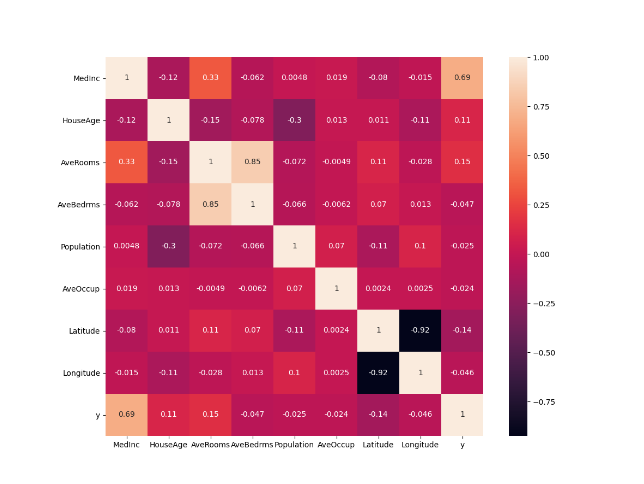

First I created the following DoKFold function:

```
def DoKFold(model, X, y, k, standardize=False, random_state=146):
    import numpy as np
    from sklearn.model_selection import KFold
    kf = KFold(n_splits=k, shuffle=True, random_state=random_state)
    if standardize:
        from sklearn.preprocessing import StandardScaler as SS
        ss = SS()
    train_scores = []
    test_scores = []

    train_mse = []
    test_mse = []

    for idxTrain, idxTest in kf.split(X):
        Xtrain = X[idxTrain, :]
        Xtest = X[idxTest, :]
        ytrain = y[idxTrain]
        ytest = y[idxTest]

        if standardize:
            Xtrain = ss.fit_transform(Xtrain)
            Xtest = ss.transform(Xtest)

        model.fit(Xtrain, ytrain)

        train_scores.append(model.score(Xtrain, ytrain))
        test_scores.append(model.score(Xtest, ytest))

        ytrain_pred = model.predict(Xtrain)
        ytest_pred = model.predict(Xtest)

        train_mse.append(np.mean((ytrain-ytrain_pred) ** 2))
        test_mse.append(np.mean((ytest - ytest_pred) ** 2))

 return train_scores, test_scores, train_mse, test_mse
        
 ```
 
 Then I imported the data:

 ```
from sklearn.datasets import fetch_california_housing
data = fetch_california_housing()
X = data.data
X_names = data.feature_names
y = data.target
  ```
 

## Question 15 ##

For this questions I creted a copy of the data frame and then calculated the correlations of all the varaibles. I also showed the calculations in a heatmap to see which is the most correlated, which turned out to be MedInc
 ```
Xy = X_df.copy()
Xy['y'] = y
# 2. calculate the correlations of all variables
Xy.corr()
corrmat = Xy.corr()
f, ax = plt.subplots(figsize=(12, 9))
sns.heatmap(corrmat, square=True, annot=True)
plt.show()
 ```


## Question 16 ##

From the previous question I used StandardScaler to transform the data to see if the MedInc is still the most correlated variable. I found that the MedInc is still the most correlated variable even when the data is standardized as seen in the new heatmap. 

 ```
from sklearn.preprocessing import StandardScaler as SS
ss = SS()
Xs = ss.fit_transform(X)
Xs_df = pd.DataFrame(X, columns = X_names)
Xsy_df = Xs_df.copy()
Xsy_df['y'] = y
Xsy_df.corr()
corrmat = Xsy.corr()
f, ax = plt.subplots(figsize=(12, 9))
sns.heatmap(corrmat, square=True, annot=True)
plt.show()
 ```
 


## Question 17 ##

From the previous two questions I used the code to see which feature is most correlated to the target variable. From looking at the heatmap found in question 15 I could see that MedInc was the most correlated variable and from there using the following code allows me to see the coefficient of determination for MedInc:


 ```
 np.round(np.corrcoef(X_df['MedInc'], y)[0][1]**2,2)
  ```

I got the answer: 0.47


## Question 18 ##

For question 18 I did not use my DoKFold function to run my linear regression but instead just used the for loop to run the training and testing data. These numbers are slightly off from the right answers which I believe is due to me not standardizing the data. When I used the DoKFold function and ran the data again I got the following results:

  ```
train_scores, test_scores, train_mse, test_mse = DoKFold(LinearRegression(), X, y, k, True)
  ```
  
Training: 0.60630

Testing: 0.60198

These results have been standardized, have a random state of 146, and use 20 fold, making this the right answer.

## Question 19 ##

I made a very stupid mistake for this question and the following. When I ran the ridge regression and the lasso model I put the testing score instead of the alpha value as my answer. 

I know that when running a ridge regression you have to import ridge and then create 101 splits spaced between 20 and 30. I created a for loop and ran the following code:

  ```
a_range = np.linspace(20, 30, 101)
k = 20

rid_tr =[]
rid_te =[]
rid_tr_mse = []
rid_te_mse = []
for a in a_range:
    rid_reg = Ridge(alpha=a)
    train_scores,test_scores, train_mse, test_mse = DoKFold(rid_reg,X,y,k,standardize=True)
    rid_tr.append(np.mean(train_scores))
    rid_te.append(np.mean(test_scores))
    rid_tr_mse.append(np.mean(train_mse))
    rid_te_mse.append(np.mean(test_mse))


idx = np.argmax(rid_te)

  ```
The results I got are: 

Optimal alpha value: 25.80000
Training score for this value: 0.60627
Testing score for this value: 0.60201
Training MSE for this value: 0.52427
Testing MSE for this value: 0.52876


## Question 20 ##

Just like the question above, for question 19 I did not put the alpha value as my answer. I ran the following code ran using Lasso and got the following answers:

  ```
from sklearn.linear_model import Lasso

k = 20

las_a_range = np.linspace(0.0001, 0.003, 101)

las_tr = []
las_te = []
las_tr_mse = []
las_te_mse = []

for a in las_a_range:
    las = Lasso(alpha = a)
    train_scores,test_scores,train_mse,test_mse = DoKFold(las, X, y, k, True)

    las_tr.append(np.mean(train_scores))
    las_te.append(np.mean(test_scores))
    las_tr_mse.append(np.mean(train_mse))
    las_te_mse.append(np.mean(test_mse))

idx = np.argmax(las_te)
  ```
I got the following results: 

Optimal alpha value: 0.00186
Training score for this value: 0.60615
Testing score for this value: 0.60213
Training MSE for this value: 0.52442
Testing MSE for this value: 0.52860


## Question 21 ## 

For question 21 as well as question 22 I did not understand the question. When I first read the question I thought it was asking us to rerun the model without using kfolds and a training and testing for loop on an entire dataset so I tried to rewrite the DoKFold function without KFold or training and testing data, which would never work. Now rereading the question I see that would not make sense at all. 

I now understand that you have to use the output from when I ran the X_df.corr() in question 15 to see which feature is the least correlated, which is AveOccup. Once I figured out that AveOccup I extracted the coefficients using  model.coef_.
From there I used the following code: 

  ```
print(X_names[5])
lin = LR(); rid = Ridge(alpha=25.8); las = Lasso(alpha = 0.00186)
lin.fit(Xs, y); rid.fit(Xs, y); las.fit(Xs, y);
lin.coef_[5], rid.coef_[5], las.coef_[5]
  ```

Got these outcomes: -0.039326266978148866, -0.039412573728940366, -0.03761823364553458
This code uses the three models from before with the alpha values that we found to fit the model for the variable AveOccup. From this I found the smallest coefficient to be the ridge regression. 


## Question 22 ##

For this question I did the same as the previous question but this time with the variable MedInc because it is the most correlated. 
I used the following code: 

  ```
print(X_names[0])
lin.coef_[0], rid.coef_[0], las.coef_[0]
  ```

The outcomes: 0.82961930428045, 0.8288892465528181, 0.8200140807502059

The smallest coefficient would be the Lasso model which is 0.8200140807502059. 

## Question 23 ##

Using the DoKfold function I found the MSE for the ridge regression:

  ```
idx = np.argmin(rid_te_mse)
print(a_range[idx], rid_tr[idx], rid_te[idx], rid_tr_mse[idx], rid_te_mse[idx])

plt.plot(a_range, rid_te_mse,'or')
plt.xlabel('$\\alpha$')
plt.ylabel('Avg MSE')
plt.show()
  ```
 
  
When I ran the code I found that they have a different optimum alpha value. 
When running the MSE I found the I found the optimum value to be 26.10000.
  
## Question 24 ##

Just like the previous question I used the DoKFold function and then found the MSE using Lasso: 

  ```
idx = np.argmin(las_te_mse)
print(las_a_range[idx], las_tr[idx], las_te[idx], las_tr_mse[idx], las_te_mse[idx])
plt.plot(las_a_range, las_te_mse,'or')
plt.xlabel('$\\alpha$')
plt.ylabel('Avg MSE')
plt.show()
  ```
 
When I ran the code  I found the optimal alpha value to be 0.00184.


