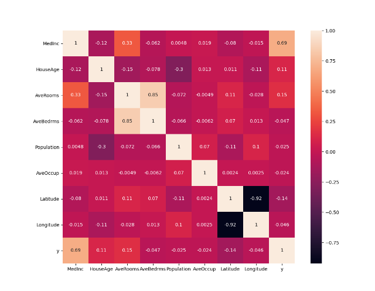

First we create the DoKFold in class that helped solve the following problems

```
def DoKFold(model, X, y, k, standardize=False, random_state=146):
    import numpy as np
    from sklearn.model_selection import KFold
    kf = KFold(n_splits=k, shuffle=True, random_state=random_state)
    if standardize:
        from sklearn.preprocessing import StandardScaler as SS
        ss = SS()
    train_scores = []
    test_scores = []

    train_mse = []
    test_mse = []

    for idxTrain, idxTest in kf.split(X):
        Xtrain = X[idxTrain, :]
        Xtest = X[idxTest, :]
        ytrain = y[idxTrain]
        ytest = y[idxTest]

        if standardize:
            Xtrain = ss.fit_transform(Xtrain)
            Xtest = ss.transform(Xtest)

        model.fit(Xtrain, ytrain)

        train_scores.append(model.score(Xtrain, ytrain))
        test_scores.append(model.score(Xtest, ytest))

        ytrain_pred = model.predict(Xtrain)
        ytest_pred = model.predict(Xtest)

        train_mse.append(np.mean((ytrain-ytrain_pred) ** 2))
        test_mse.append(np.mean((ytest - ytest_pred) ** 2))

        return train_scores, test_scores, train_mse, test_mse
        
 ```

## Question 17 ##

From the previous two questions I used the following code to see which feature is most correlated to the target variable:

 ```
from sklearn.preprocessing import StandardScaler as SS
ss = SS()
Xs = ss.fit_transform(X)
Xs_df = pd.DataFrame(X, columns = X_names)
Xsy_df = Xs_df.copy()
Xsy_df['y'] = y
Xsy_df.corr()
corrmat = Xsy_df.corr()
f, ax = plt.subplots(figsize=(12, 9))
sns.heatmap(corrmat, square=True, annot=True)
plt.show()
 ```
 


From looking at the heatmap I could see that MedInc was the most correlated variable and from there using the following code allows me to see the coefficient of determination for MedInc:


 ```
 np.round(np.corrcoef(X_df['MedInc'], y)[0][1]**2,2)
  ```

I got the answer: 0.47


## Question 18 ##

For question 18 I did not use my DoKFold function to run my linear regression but instead just used the for loop to run the training and testing data which gave the results: Training: 0.60630 and Testing: 0.60198. These numbers are slightly off from the right answers which I believe is due to me not standardizing the data. When I used the DoKFold function and ran the data again I got the following results:

Training: 0.60520

Testing: 0.62439

These results have been standardized, have a random state of 146, and use 20 fold, making this the right answer.

## Question 19 ##

I made a very stupid mistake for this question and the following. When I ran the ridge regression and the lasso model I put the testing score instead of the alpha value as my answer. 

I know that when running a ridge regression you have to import ridge and then create 101 splits spaced between 20 and 30.

  ```
a_range = np.linspace(20, 30, 101)

  ```
Then creating a for loop to find the alpha and testing and training scores for the ridge regression. The results I got are: 


## Question 20 ##

## Question 21 ## 

For question 21 as well as question 22 I did not understand the question. When I first read the question I thought it was asking us to rerun the model without using kfolds and a training and testing for loop on an entire dataset so I tried to rewrite the DoKFold function without KFold or training and testing data, which would never work. Now rereading the question I see that would not make sense at all. 

I now understand that you have to use the output from when I ran the X_df.corr() in question 15 to see which feature is the least correlated.

From there I 

## Question 22 ##

