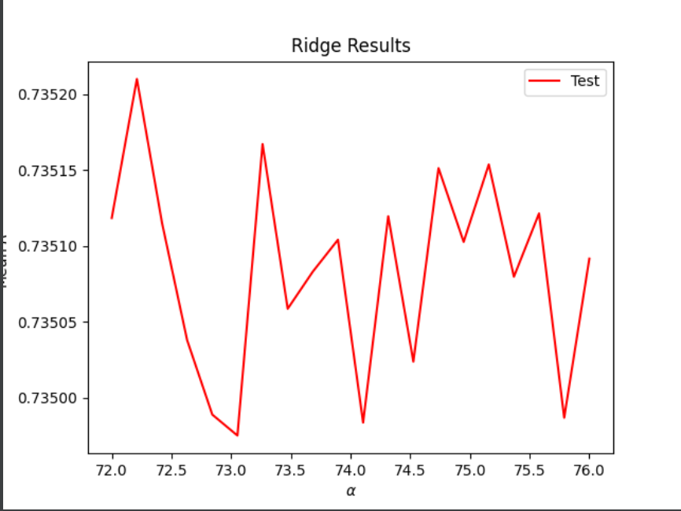

## Download the anonymized dataset describing persons.csv from a West African county and import it into your PyCharm project workspace (right click and download from the above link or you can also find the data pinned to the slack channel). First set the variable wealthC as your target. It is not necessary to set a seed. ##

To set up for this lab I imported the data and then dropped the na, which was about 70-80 data points, which should not affect the outcomes. After I checked the data types I changed age and edu to int. I set the features for X, dropping wealthC and wealthI and setting these as the target for the following regressions. 

``` 
person = pd.read_csv('persons.csv')
person.dropna(inplace=True)

person['age'] = person['age'].astype(int)
person['edu'] = person['edu'].astype(int)

X = person.drop(["wealthC", "wealthI"], axis = 1)
# y = person.wealthI
y = person['wealthC']
``` 

## WealthC ##

linear regression and compute the MSE:

Using the DoKFold I found the MSE and R-squared value for the non-standardized data.

Linear regression MSE: 0.44281007841525455

R^2: 0.7358350529917901, 0.7350947936071446

Standardize the features and again compute the MSE:

Using the DoKFold I found the MSE and R-squared value for the standardized data. By using StandardScaler I found the following values:

Linear regression MSE: 0.4428133309487589

R^2: 0.7358274064493783, 0.7350733545939001

I found that the values did not change when the data was standardized. Yet, looking at the coefficients of the standardized data and non-standardized they are slightly different. Standardizing the data has an impact on the coefficients individually but not the overall R^2 values. 

ridge regression:

For ridge regression I started by using a_range = np.linspace(0, 120, 110) to try and find a starting point from there I kept narrowing what my range should be in order to find the best results. In the end my best outcome would have to be the range: a_range = np.linspace(72, 76, 20) with my results being:

Optimal alpha value: 72.21053
Training score for this value: 0.73584
Testing score for this value: 0.73521

These results are slightly better than the linear regression. 



lasso regression:
For lasso I started with a range of 0.0001 to 0.003 and then tried several different configurations to try and find the best alpha. I kept trying different numbers until I ended up using 0.00025 to 0.00029 which gave me the results: 

Optimal alpha value: 0.00028
Training score for this value: 0.73583
Testing score for this value: 0.73515

These results are slightly worse than the ridge results. 

## WealthI ##

linear regression and compute the MSE:

Linear regression MSE: 1750276834.9304745

R^2: 0.8258335702133426, 0.8252583983625497

Standardize the features and again computer the MSE:

Linear regression MSE: 1750287416.4378276

R^2: 0.8258367991339716, 0.8252464937866233

When I standardized the data there was no change in the R^2 value. Yet, when looking at the coefficients individually, you can see a large change between the standardized and nonstandardized values just like WealthC. For example, 2.31986195e+03 is now 8.64993728e+03 with the standardized data. There was no impact on the R^2 value when the data is standardized but there is an impact on the individual coefficients.

ridge regression:

lasso regression:

## Which of the models produced the best results in predicting wealth of all persons throughout the smaller West African country being described? ##


