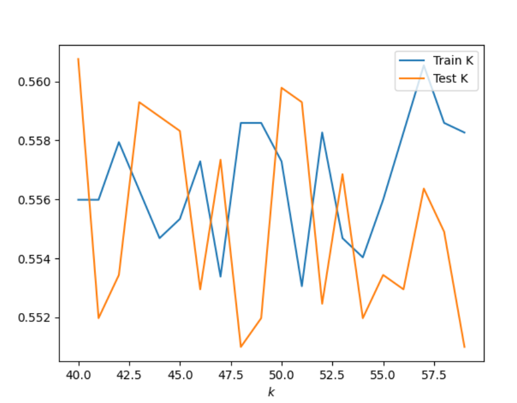
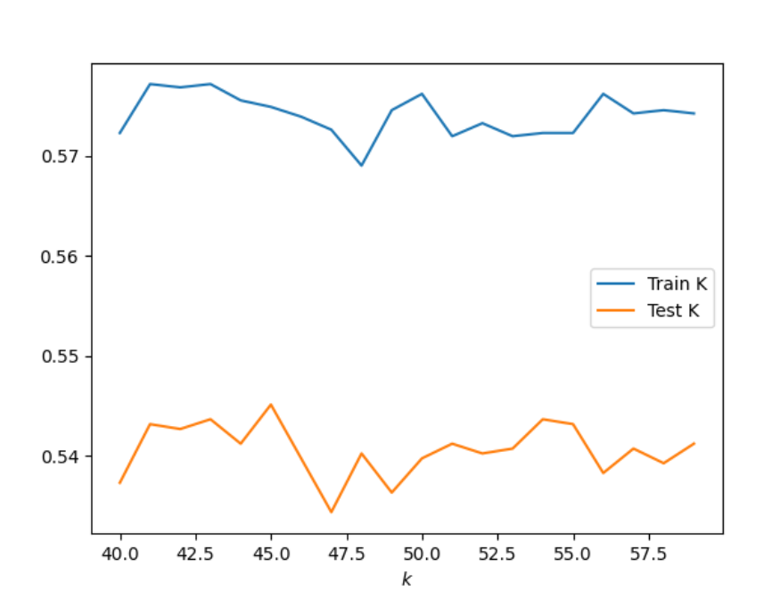
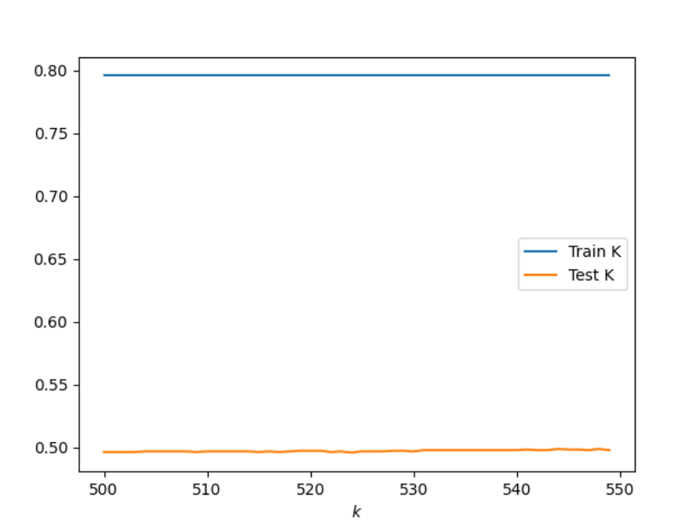

## 1. Execute a K-nearest neighbors classification method on the data. What model specification returned the most accurate results? Did adding a distance weight help? ## 

KKN model: For this model I tried several different K-ranges to try and figure out which model would return the most accurate results. I first tried the range 10-100. After looking at the graph, which is seen below, I saw that once the training and testing data were the closest between the range 40-60 and then slowly declined. From this observation I tried a few more ranges, such as 10-80, but ultimately decided that the range 40-60 gave the best results. These results are: 40, 0.5607613469985359.
These results can also be seen in the graph below.

Range 10-100 graph:

Range 40-60 graoh:

KNN Model adding a distance weight: 

By adding a distance weight I had to definitely go up in my range values. I checked a range of values from 10-1080, not all at once, but in different iterations. When adding a distance weight it clearly shows that train dataset is much more accurate than the test data as seen in the graph below. The best results that I found was with the range 500-550 with results: 501, 0.5217179111761835. I bootstrapped this ranged and found similar results after running the data several times so I think it is the best outcome. By adding a distance weight, I did not find as accurate results as I did in the orginial model. 

## 2. Execute a logistic regression method on the data. How did this model fair in terms of accuracy compared to K-nearest neighbors? ##

I executed a logistic regression method on the data and got the following results:

Training Score: 0.5452473958333334
Testing Score: 0.5495363591996095

As you can see the accuracy is better with the logistic regression model than the K-nearest neighbor models. 

## 3. Next execute a random forest model and produce the results. See the number of estimators (trees) to 100, 500, 1000 and 5000 and determine which specification is most likely to return the best model. Also test the minimum number of samples required to split an internal node with a range of values. Also produce results for your four different estimator values by both comparing both standardized and non-standardized (raw) results. ##\

When I executed the random forest model I got the following results: 

|   Estimators    | Training              | Testing              | 
| --------------- |:---------------------:| --------------------:|
| 100             | 0.8017578125          | 0.5046364080039043   | 
| 500             | 0.8017578125          | 0.5021961932650073   | 
| 1000            | 0.8017578125          | 0.5026842362127867   | 
| 5000            | 0.8017578125          | 0.5080527086383602   |

From these results, I determines that 5000 is the specification that is most likely to return the best model. I then tested the minimum number of samples required to split an internal node with a range of values. From this I found that a range between 20 and 30 brought the training and testing scores closer together with the training scores being between 0.634765625 and 0.650390625 and the testing scores being between 0.5588091752074182 and 0.5641776476329917. 

Next I standardized the data and compared the accuracy between the standardized and nonstandardized data, which can be seen in the below. As you can see, for the non-standardized data 5000 estimators is the most accurate while for the standardized data 1000 estimators is the most accurate. 

|   Estimators    | Non-Standardized      | Standardized         | 
| --------------- |:---------------------:| --------------------:|
| 100             | 0.49                  | 0.50                 | 
| 500             | 0.50                  | 0.49                 | 
| 1000            | 0.50                  | 0.51                 | 
| 5000            | 0.51                  | 0.50                 |

## 4. Repeat the previous steps after recoding the wealth classes 2 and 3 into a single outcome. Do any of your models improve? Are you able to explain why your results have changed? ##

KNN Model: Creating classes 2 and 3 into a single outcome I got the results: 45, 0.5451439726695949. I used the range 40 to 60 and ran the model several times to see the outcomes. These were my best results which can be seen in the graph below. These results are not as accurate as the first time I ran the KKN Model. 

KNN adding distance weight: 
My results were: 544, 0.4987798926305515. I used the range 500-550 as you can see in the graph below. These results not as accurate as the original data. 

Logistic Regression

I executed a logistic regression method on the data and got the following results:

train score logistic regression: 0.5546875

test score logistic regression:  0.5348950707662274

When I ran the logistic regression method the test score was overall more accurate when using the combined data, but the train score was a little lower than the previously run data. 

random forest model:

I got the following results: 

|   Estimators    | Training              | Testing              | 
| --------------- |:---------------------:| --------------------:|
| 100             | 0.7952473958333334    | 0.5061005368472425   | 
| 500             | 0.7952473958333334    | 0.5036603221083455   | 
| 1000            | 0.7952473958333334    | 0.5056124938994632   | 
| 5000            | 0.7952473958333334    | 0.4992679355783309]  |

|   Estimators    | Non-Standardized      | Standardized         | 
| --------------- |:---------------------:| --------------------:|
| 100             | 0.509028794533919     | 0.486090775988287    | 
| 500             | 0.4895070766227428    | 0.4895070766227428   | 
| 1000            |0.48316251830161056    | 0.5012201073694486   | 
| 5000            | 0.5075646656905808    | 0.49731576378721326  |

With the recoding of classes 2 and 3 into a single outcome the models overall are not as accurate. There are some slight increases in accuracy, such as for the logistic regression training data score but overall the combination of the two variables into a single outcome did not give more accurate results. With the combination of the classes 2 and 3 the predicitve ability decreases and this could be due to a lower variability in the data. 

## 5. Which of the models produced the best results in predicting wealth of all persons throughout the large West African capital city being described? ##

Overall the models that used the data that did not combine the wealth classes 2 and 3 were accurate over the condensed outcomes. Out of all the models that I produced the one that had the best results in predicting wealth of all persons throughout the large West African captial city is the KNN model without distance added. This model had an accuracy 0.5607613469985359, which is about 56%, which is better than the 54% that I got from the other models. 
