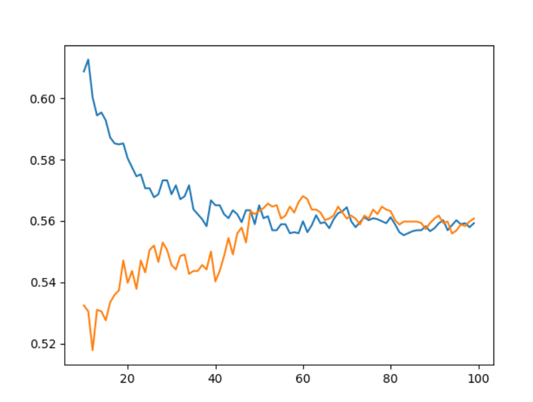
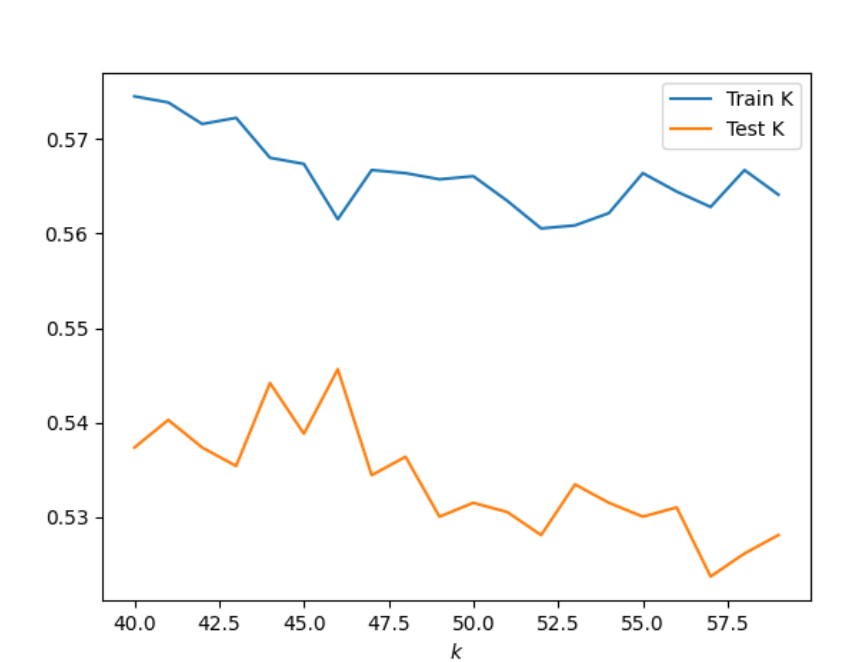
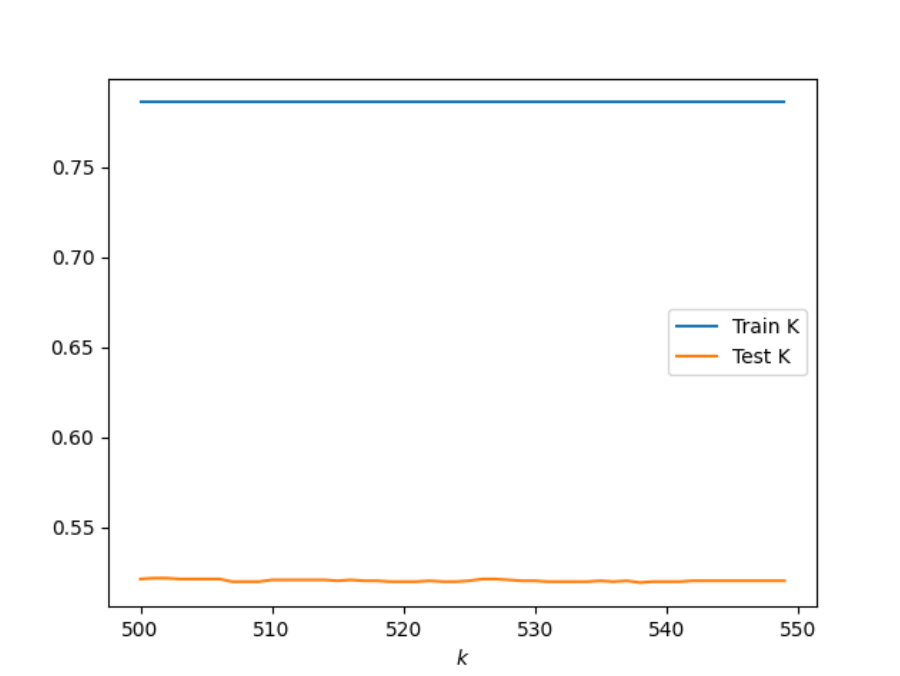

## 1. Execute a K-nearest neighbors classification method on the data. What model specification returned the most accurate results? Did adding a distance weight help? ## 

KKN model: For this model I tried several different K-ranges to try and figure out which model would return the most accurate results. I first tried the range 10-100. After looking at the graph, which is seen below, I saw that once the training and testing data were the closest between the range 40-60 and then slowly declined. From this observation I tried a few more ranges, such as 10-80, but ultimately decided that the range 40-60 gave the best results. These results are:46, 0.5456320156173743. These results can also be seen in the graph below.

Range 10-100 graph:

Range 40-60 graoh:

KNN Model adding a distance weight: 

By adding a distance weight I had to definitely go up in my range values. I checked a range of values from 10-1080, not all at once, but in different iterations. When adding a distance weight it clearly shows that train dataset is much more accurate than the test data as seen in the graph below. The best results that I found was with the range 500-550 with results: 501, 0.5217179111761835. I bootstrapped this ranged and found similar results after running the data several times so I think it is the best outcome. By adding a distance weight, I did not find as accurate results as I did in the orginial model. 

## 2. Execute a logistic regression method on the data. How did this model fair in terms of accuracy compared to K-nearest neighbors? ##

I executed a logistic regression method on the data and got the following results:

train score logistic regression:0.5582682291666666

test score logistic regression: 0.5402635431918009

As you can see the accuracy is better with the logistic regression model than the K-nearest neighbor models. 

## 3. Next execute a random forest model and produce the results. See the number of estimators (trees) to 100, 500, 1000 and 5000 and determine which specification is most likely to return the best model. Also test the minimum number of samples required to split an internal node with a range of values. Also produce results for your four different estimator values by both comparing both standardized and non-standardized (raw) results. ##

## 4. Repeat the previous steps after recoding the wealth classes 2 and 3 into a single outcome. Do any of your models improve? Are you able to explain why your results have changed? ##

## 5. Which of the models produced the best results in predicting wealth of all persons throughout the large West African capital city being described? ##

